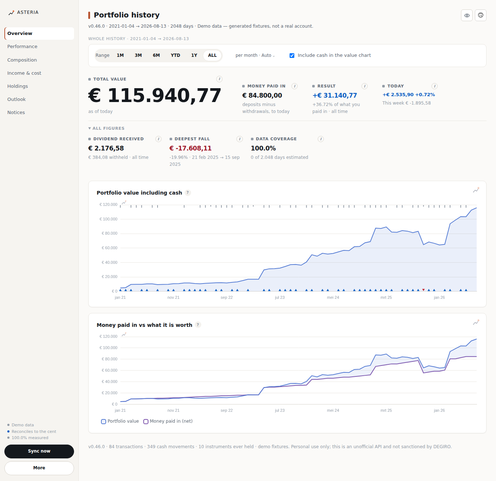

# DEGIRO Portfolio History

A Chrome extension that shows what your DEGIRO account has been worth, every day since
you opened it — the chart DEGIRO's own interface does not give you.

It reconstructs the history from your trades, cash movements and daily closing prices,
using the session your browser already holds. No password is asked for, nothing is
stored anywhere but your own machine, and nothing is sent to anyone but DEGIRO.



## Install it

**[→ Step-by-step guide, in Dutch (INSTALL.md)](INSTALL.md)** — no terminal, no Node,
about two minutes.

The short version: **Code → Download ZIP**, unzip somewhere permanent, then
`chrome://extensions` → **Developer mode** on → **Load unpacked** → pick the unzipped
folder.

Then click the extension icon → **Open full chart** → **Open the demo** to see the
charts with sample data before pointing it at your own account. When you're ready: log
in at [trader.degiro.nl](https://trader.degiro.nl), click the icon, press **Sync**.

The first sync takes a few minutes — one request per second, deliberately. DEGIRO's API
is undocumented and hammering it is an account-safety risk, not a matter of politeness.

## What you get

| Chart | What it answers |
|---|---|
| **Portfolio value including cash** | What was it worth on any given day. Triangles on the baseline mark days money went in or out, so a deposit is never mistaken for a gain. |
| **Result per period** | Day, week or month performance with deposits and withdrawals stripped out. |
| **Cumulative result** | The same numbers added up over the range you picked. |
| **What the portfolio is made of** | Stacked daily value per holding — how much is which position, and how much is sitting in cash. |
| **Money paid in vs what it is worth** | Your net deposits against the market value. The gap between the lines is growth. |
| **Deposits and withdrawals per month** | Net external cashflow. None of it counts as profit. |
| **Month by month** | Every month of every year as a grid. Read across a row for one year, or down a column to compare the same month across years. |
| **Compare months** | Click cells to compare specific months — September 2025 against November 2020 — or a month name to put that month side by side across every year. |
| **Dividend per month** | Net cash received, with withholding tax below the line. |
| **Holdings** | The same series as plain numbers. |

Range selector (1M / 3M / 6M / YTD / 1Y / ALL), a day/week/month granularity that applies to
every chart, hover crosshair, and an include/exclude-cash toggle.

The month views have a **Euro / Return %** switch, and it is not cosmetic. €500 on a
small portfolio is a very different month from €500 on a large one, so euros are not
comparable across years. The percentage is a daily-chained return with deposits removed,
so a month you paid money into is not flattered by it.

## The one thing to pay attention to

Two checks, and the first one is strict. **DEGIRO states the size of every position you
hold, and the page checks its own share counts against them.** Those counts come from your
transaction history, so any disagreement means the history is incomplete or misread — and
every day in the chart rests on it. That is reported in red, naming the instrument.

The second compares the reconstructed total against the total DEGIRO reports, to the cent.
When it fails, it now says which kind of failure it is: share counts disagreeing is the
history being wrong, share counts agreeing while values differ is a disagreement about
prices — which happens honestly, because for an instrument that rarely trades DEGIRO's own
live total and its own daily closes do not match each other.

A portfolio chart that is quietly wrong is worse than no chart, so the extension would
rather tell you it failed than round the difference away.

Same principle for the yellow warnings: a cash movement whose description it does not
recognise is reported rather than guessed at, because guessing "deposit" would silently
turn your own money into profit.

## Status, honestly

**Version 0.10.0.** Everything in [SPEC.md](SPEC.md) is built, and the engine is covered
by 147 tests — including "a deposit must not register as profit", "a closed round trip
holds nothing", "an option trade is not an exchange rate", and the reconciliation check
above. Release notes are in [CHANGELOG.md](CHANGELOG.md).

**If you are updating from an earlier version, press "Wipe & resync".** Every number is
recomputed from the raw responses, and the stored ones predate these fixes.

It has been run against three real DEGIRO accounts, and what that turned up is worth
reading if you care whether the numbers are right — several were the difference between a
plausible chart and a true one:

- **A portfolio charted at €429 million** against €116k ever paid in. The price series
  are adjusted for share splits; your transaction history is not. Every quote is now
  audited against the price you actually paid on that same day.
- **Options valued as if one contract were one share.** A contract covers a hundred
  shares, or ten, or a hundred and three after a corporate action. On one account that
  put the total €39 758 above DEGIRO's own. The contract size is now measured per
  instrument from what you actually paid — no table of sizes would have got the 103 right.
- **Exchange rates read off trades, which include options**, so a currency traded only
  through options came out a hundredfold wrong: CHF at 107 instead of 1,07, DKK at 13,39
  instead of 0,134. Rates now come from the currency conversions DEGIRO itself booked,
  which state the rate outright.
- **17,36 shares of a bankrupt company** on the books of an account that had sold every
  one of them, because a buy and its matching sell were divided by slightly different
  split factors and stopped cancelling.
- **46 cash movements silently lost** to `id: 0` storage collisions, and **59 holdings
  with no price history** because their identifier was requested as the wrong type.

What is still open:

- **`fixtures/` is generated, not captured.** The demo data reproduces the response
  *shapes* the spec describes; real accounts have since confirmed many of them, but their
  data is not in this repository and will not be. What is evidence and what is still an
  assumption is written out per endpoint in
  [docs/ENDPOINT-REPORT.md](docs/ENDPOINT-REPORT.md). To check the engine against your own
  account, export it and run `npm run audit path/to/export.json` — that stays on your
  machine.
- **An account holding illiquid options will not reconcile to the cent.** DEGIRO's live
  total and its own daily closes disagree for instruments that rarely trade. The page says
  so and names them, rather than pretending the difference is not there.
- **Some instruments have no price history at all** — usually a delisting. Those
  positions are valued at the last price they traded at, so their movement between trades
  is not real. The page says which ones.
- **A currency you have never traded or converted has no rate**, so it stays at 1:1 and
  says so in red.

If something looks wrong, press **Check connection**: it walks all seven steps of the
sync and reports which one broke, with HTTP statuses and row counts but no session id,
account number or amounts — so the report is safe to paste into an issue.
[docs/CAPTURE.md](docs/CAPTURE.md) explains how to capture a HAR from your own session
if you want to close the remaining gaps.

## For developers

```bash
npm test                       # 147 tests, no dependencies to install
npm run demo                   # the whole UI on generated fixtures at localhost:5173
npm run fixtures               # regenerate the sample data
npm run audit path/to/export   # run the engine over a real export and check its invariants
```

`npm run audit` is the one that matters. It runs the real engine over an account exported
from the extension and checks five things against DEGIRO's own figures: a closed round trip
holds nothing, the ledger matches what was booked, open positions match the sizes DEGIRO
reports, P/L plus external flow equals the change in value, and nothing is worth anything
unless it is held. Both defects fixed in 0.10.0 were found this way, and neither was
visible from reading the code.

Chart.js is vendored (MV3 forbids remote scripts), so there is no `npm install` step.

```
manifest.json     MV3 manifest
src/sw.js         service worker: hourly alarm, opportunistic sync, message router
src/lib/          config, dates, classify, parse, engine, store, degiro, session, sync
src/ui/           full page, popup, chart builders, design tokens
vendor/           Chart.js 4.4.7
fixtures/         generated sample data — see the status note above
test/             node --test
tools/            fixture generator, HAR→fixtures converter, dev server, icons
docs/             endpoint report, HAR capture guide
```

How it works:

```
transactions     ──►  position ledger: quantity per instrument per day  ─┐
cash movements   ──►  cash balance per day, net external cashflow       ─┼─►  value[t]
vwd daily closes ──►  forward-filled price per instrument per day       ─┘

pnl[t] = (value[t] − value[t−1]) − netExternalCashflow[t]
```

Only the raw API responses are stored. Every chart number is derived on the fly and
thrown away, so fixing a bug is a recompute rather than a migration.
`src/lib/engine.js` does all of it and touches nothing else — no network, no database,
no Chrome APIs — which is what makes it testable.

Conventions, and the decisions not worth relitigating, are in [CLAUDE.md](CLAUDE.md).

## Terms

Personal use. This talks to an unofficial, reverse-engineered API: read-only, to your
own data, from your own logged-in browser — the mildest form of it, but not sanctioned
by DEGIRO and liable to break without notice. Don't publish it to the Chrome Web Store.

Everyone who installs it uses their own DEGIRO login; there is no shared data and
nobody can see anyone else's portfolio.

There are no API keys or stored credentials: the extension uses the session cookie your
browser already holds, read per request and never written to disk, logged, or exported.
Requests go to `trader.degiro.nl` and `charting.vwdservices.com` and nowhere else. The
**Export JSON** file — the one to send with a bug report — has your name, account number
and user token redacted; it still contains your holdings and amounts, so share it with
someone you trust.

Chart.js is MIT licensed — see `vendor/chart.js-LICENSE.md`.
